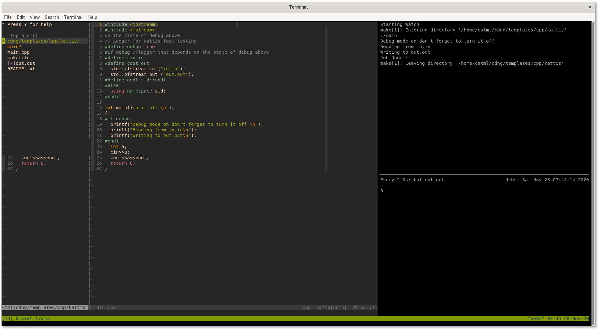

# Competing

At Bath University, each Saturday the Bath Computer Science Society organises
programming competitions. The format is:  
- teams of 3/2 people 
- 4 hours  
- 5/6 problems from Kattis


After competing for a while, I realised I could streamline my environment to
suit the needs of such a competition. As the old adage goes, **every second
counts**, so I think you will agree this set-up is both nice, and incredibly
streamlined.

## C++ Template 

The first thing that is (annoying) different about Kattis is that the
submission and testing takes place over the `stdout` `stdin`. So whenever I was
writing the code in C++ I always had to go back at the end and swap all of my
input output from files (which I use for testing) to stdin stdout. It is both
frustrating, and is prone to error as you can very easily mess something up and
then sit there and wonder why you got 0 points (not g00d).

That is why I came up with this nifty way of swapping between debugging and
submission by using the pre-compiler capabilities of C++:

```C++
// Logger for Kattis fast testing
#define debug true

#if debug //logger 
#define cin in
#define cout out
  std::ifstream in ("in.in");
    std::ofstream out ("out.out");
#define endl std::endl
#else
      using namespace std;
#endif
```

So what the code is doing is :

1. setting debug to be equal to true - this is set to false when submitting the
   problem to kattis and to true while debugging and testing

2. the first pre-compiler if checks if the debugger is on, if it is it defines
   `cin` and `cout` as being in and out which then are my declare in and out
   streams. Essentially we are hijacking the `cin` and `cout` to do something
   else than they would normally do. I would not recommend doing such manoeuvrers
   in a live project.

3. if the debug is false then just use the normal `cin` `cout`

I think you can agree this is nice, and tidy. Because in the heat of the moment
I might forget that it is in debug mode I also have added this to the `main`:

```c++
#if debug
printf("Debug mode on don't forget to turn it off \n");
printf("Reading from in.in\n");
printf("Writing to out.out\n");
#endif
```

You can see this in my templates folder on [github]()

## Continuous Testing 

Another thing that saves loads of time is continuously testing in a terminal
while you are coding. This allows for quick feedback, and the ability to be on
top of your code at all times. To achieve this I have made use of `cmake`,
`entr`, and a bit of `bash`.

```makefile
COMP:=g++
FLAGs:=-g
FILE:=main
SRC:=$(FILE).cpp
OBJ:=$(FILE).o

.PHONY: execute watch watch-output clean

execute: $(FILE)
  ./$<
  @echo "Job Done!!"

$(FILE): $(SRC)
  $(COMP) $(FLAG) -o $@ $(SRC)

watch: 
  @echo "Starting Watch"
  @ls *.cpp | entr make execute

watch-output: 
  @watch bat out.out
```

So whenever I start coding, I have a terminal with `make watch` and a terminal
with `make watch-output` running. This way my code is compiled and executed
automatically, with the correct flags for debugging and all the errors are
always on the screen. Tidy! 


## vImDE (tmux)

I use vim as my text editor, and recently I have started using tmux. Prior to
tmux I used to have a window manager and then i swapped to using floating
windows and resizing, but it never felt efficient. I always ended up with
multiple desktops with multiple terminals, and it was very easy  to just close
one by accident. It did not feel robust or pleasant.  (although I am guilty
even now of just popping a new floater terminal around) 

And then i stumbled upon tmux and my whole world of terminal working has never
been the same since.  I will do a separate post on tmux, because it is great
but let's see what I've done for this specific case: 
- I've created a shell script that opens a new session with 2 windows
- first window has vim and my two watches (turned on)
- second window has the input 

```bash
#!/bin/sh
tmux new-session    -d  'vim';
tmux split-window   -h  'make watch'; # this goes well with my kattis template for c++
tmux resize-pane    -y 5 -x 10;
tmux split-window   -v 'make watch-output';
tmux new-window        'vim in.in';
tmux -2 attach-session -d;
```

And this is how it all looks:



Hope you liked it and let me know if this was useful for you or if you have any
tips
